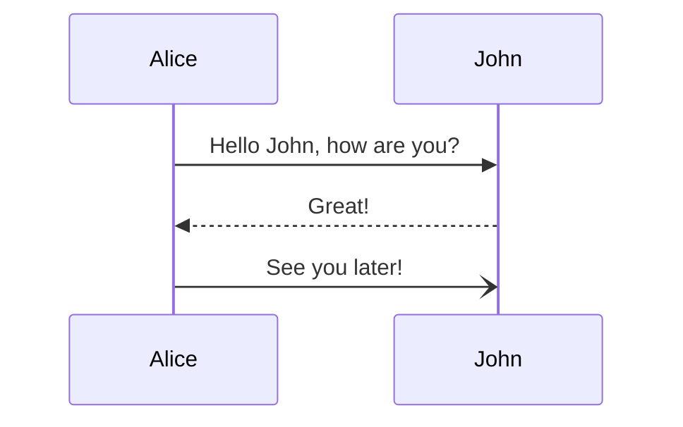
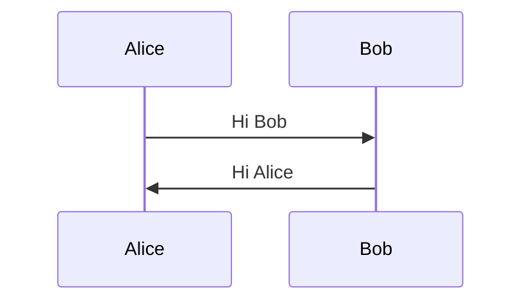
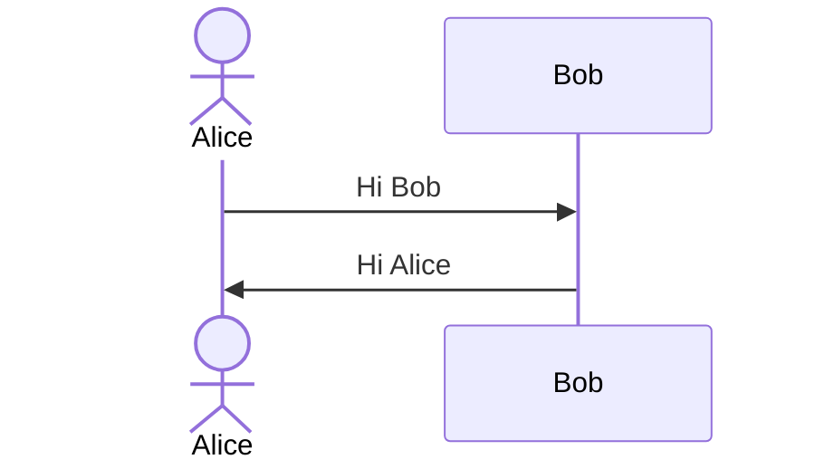
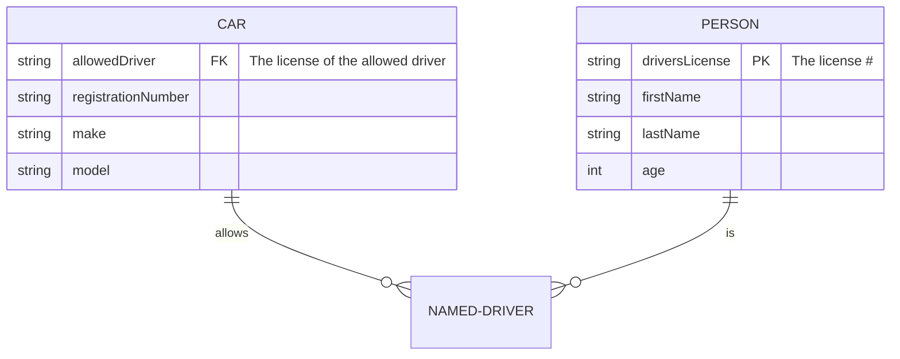
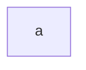
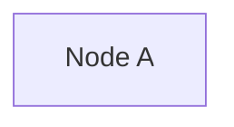
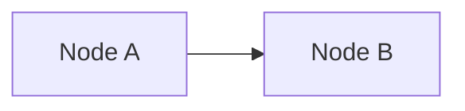
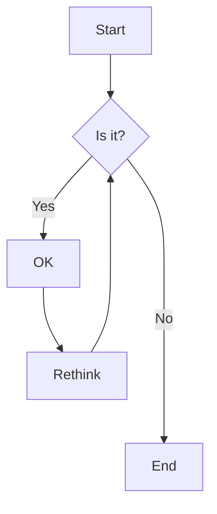

# The Problem

Even though I am mostly labeled as a Frontend Software Engineer, there are times when I actually do the entire full stack from end to end. On one end, I would create the UI. In the middle, I would create the API in Node.js, Python, or Go. At the other end, I would configure my database schemas any my database, whether in Postgres, mySQL, or sometimes in MongoDB. Since there are so many components involved in a flow, it became hard to track without drawing it out. I would then diagram these systems so that my co-workers or my team would actually understand what is going on. Usually they would come in the form of a drawing on a whiteboard, but now in these remote days, that is difficult.

I used to remember my electrical engineering professor would teach with a tablet and a digital stylus. They would create diagrams of system flows. Seeing how convenient it was, I too owned a tablet PC. Writing down notes was fun, because I didn't have to use a eraser and a pencil. I used to make messes because professors usually like to put things in the middle in diagrams. They would have the convience of dry erase, or a tablet PC, but us students don't. With a tablet PC, I had no messes. Downside is that I can't use tablet PCs in exams though if I am able to use my notes. Now, my tablet PC is in the depths of my archives, as it is already 10+ years old and the hinge broke. Although the PC still works, I can't use personal PCs for work. Nor can I ask for a tablet either.

For work, if there is a Mac option, I'll usually opt in for that. That is because it's the easiest to get up and running with a Mac rather than a PC. Macs don't come with touchscreens though, so it cannot be utilized like a tablet. There are tools like [Google Jamboard](https://jamboard.google.com/) that aim to provide whiteboards for everyone, but most engineers out there will most likely have a keyboard and a mouse/touchpad. Drawing with a mouse / touchpad is painful.

Ever since the pandemic shifted the way how we work in engineering, I wanted to find a way to create diagrams easily. There are tools like [Google Slides](https://docs.google.com/), [Google Drawings](https://docs.google.com/drawings/) and [Lucidcharts](https://www.lucidchart.com/pages/) (note I actually did not know there's a way to do it with UML until today), but they all have one thing in common: it is a chore to update the manually created diagrams. Updating it would be a pain. The arrows won't line up sometimes, and it kinda looked unprofessional everytime I updated the diagrams.

# Enter Visualizations as Code

I am a Software Engineer. I can pick up a language and learn it. Is there a way to create diagrams with code?

There are four ways that I know of:

- [plantuml](https://plantuml.com/)
- [graphviz](https://graphviz.org/)
- [mermaid](https://mermaid-js.github.io/mermaid/#/)
- [Lucidcharts](https://www.lucidchart.com/pages/examples/uml_diagram_tool)

[Github just added support for Markdown](https://github.blog/2022-02-14-include-diagrams-markdown-files-mermaid/), and I use Github a lot. So I went with this. I immediately fell in love with it. I no longer needed to fiddle with Google Drawings. I no longer had to go into Lucidcharts. I just had to code it. The nice thing is that I can also include it in Github as markdown files, or even in comments. That is a game-changer. I'll go over the 3 most used diagrams that I use in mermaid.

# Sequence Diagrams

As per [mermaid](https://mermaid-js.github.io/mermaid/#/sequenceDiagram):

> A Sequence diagram is an interaction diagram that shows how processes operate with one another and in what order.

In Frontend or Full-stack engineering, I commonly use this kind of diagram when talking about requests and responses:

- Given this request, what DBs or microservices are involved?
- Who is making the response, and how are we interpreting responses between different microservices?

To create a sequence diagram, first tell mermaid what kind of diagram to make:

```
sequenceDiagram
```

In mermaid, a sequence diagram has **participants**. Each **participant** participates in the sequence diagram, and we use the following notation:

```
participant A <OP> participant B
```

Here are the operations that it supports:

| Type | Description                                      | When to use                                                                                                  |
| ---- | ------------------------------------------------ | ------------------------------------------------------------------------------------------------------------ |
| ->   | Solid line without arrow                         |                                                                                                              |
| -->  | Dotted line without arrow                        |                                                                                                              |
| ->>  | Solid line with arrowhead                        | Sync, when sender must wait for a response to a message before it continues                                  |
| -->> | Dotted line with arrowhead                       |                                                                                                              |
| -x   | Solid line with a cross at the end               |                                                                                                              |
| --x  | Dotted line with a cross at the end.             |                                                                                                              |
| -)   | Solid line with an open arrow at the end (async) | Async, don't require a response before the sender continues. Only the call should be included in the diagram |
| --)  | Dotted line with a open arrow at the end (async) |                                                                                                              |

Participants can be declared explicitly or implicitly. For example, this is how it works implicitly:

```
sequenceDiagram
    Alice->>John: Hello John, how are you?
    John-->>Alice: Great!
    Alice-)John: See you later!
```



Mermaid will know that the participants are `Alice` and `John`. They are rendered according to the order of appearance in the diagram source text. However, sometimes we want to show the participants in a different order. To do this, we declare the participants upfront using the `participant` keyword. At the same time, this will declare how the order looks like.

```
sequenceDiagram
    participant Alice
    participant Bob
    Alice->>Bob: Hi Bob
    Bob->>Alice: Hi Alice
```



If we want to use the actor symbol, instead of using `participant`, just use the keyword `actor`:

```
sequenceDiagram
    actor Alice
    participant Bob
    Alice->>Bob: Hi Bob
    Bob->>Alice: Hi Alice
```



There's so much other configuration that I could go into when it comes to sequence diagrams. You can find the documentation [here](https://mermaid-js.github.io/mermaid/#/sequenceDiagram). I like using sequence diagrams because I often need to describe sequence flows and the participants involved.

# Entity-Relationship (ER) Diagrams

> An entity–relationship model (or ER model) describes interrelated things of interest in a specific domain of knowledge. A basic ER model is composed of entity types (which classify the things of interest) and specifies relationships that can exist between entities (instances of those entity types).

ER diagrams are the next type of diagrams I love to use in my day-to-day work. It is best for describing relationships in a database, and what kind of properties are within a table. Like `sequenceDiagram`, we first declare what we are making:

```
erDiagram
```

```
    <first-entity> [<relationship> <second-entity> : <relationship-label>]
```

Here are the possible relationship values that we can have:

| Value (left) | Value (right) | Meaning                       |
| :----------: | :-----------: | ----------------------------- |
|    `\|o`     |     `o\|`     | Zero or one                   |
|    `\|\|`    |    `\|\|`     | Exactly one                   |
|     `}o`     |     `o{`      | Zero or more (no upper limit) |
|    `}\|`     |     `\|{`     | One or more (no upper limit)  |

Now, I still don't really understand how to read it, but the documentation provides a good example to ponder upon:

```
    PROPERTY ||--|{ ROOM : contains
```

This statement can be read as _a property contains one or more rooms, and a room is part of one and only one property_.

For each entity, we can also add properties. Here is an example:

```
CAR {
        string allowedDriver FK "The license of the allowed driver"
        string registrationNumber
        string make
        string model
    }
```

A fully-fledged entity-relationship diagram can look like the following:

```
erDiagram
    CAR ||--o{ NAMED-DRIVER : allows
    CAR {
        string allowedDriver FK "The license of the allowed driver"
        string registrationNumber
        string make
        string model
    }
    PERSON ||--o{ NAMED-DRIVER : is
    PERSON {
        string driversLicense PK "The license #"
        string firstName
        string lastName
        int age
    }
```



- A car allows 0 or more named drivers. Zero or more named drivers is allowed in this one car.
- A person is 0 or more named drivers. Zero or more named drivers is one person.

Please correct me if I am wrong. I'm still learning how to make sense of the English behind it.

Like sequence diagrams, the mermaid documentation is rich and full of a lot of configuration for entity-relationship diagrams. [See it here](https://mermaid-js.github.io/mermaid/#/entityRelationshipDiagram).

# Flowcharts

> A flowchart is a diagram that depicts a process, system or computer algorithm.
> From [Lucidcharts](https://www.lucidchart.com/pages/what-is-a-flowchart-tutorial)

The flowchart was what I tend to use when describing diagrams early in my career. It was something I would diagram in lucidcharts by hand, manually. Lucidcharts has a UML option for this, but we can't embed lucidcharts within Github. We can however embed mermaid diagrams! Let's learn how.

Unlike the other diagrams, for a flowchart, the declaration is `flowchart DIRECTION`. If I want a left to right flow chart, I just type `LR`, like so:

```
flowchart LR
```

Here are the possible flowchart orientations:

- TB - top to bottom
- TD - top-down/ same as top to bottom
- BT - bottom to top
- RL - right to left
- LR - left to right

## Nodes

To make a node, all we need to do is just write something. To make a node called `a`, here's the example:

```
flowchart LR
    a
```



I can then also write different text in the node, like so:

```
flowchart LR
    a[Node A]
```



## Arrows

With multiple nodes, we can create arrows in between them.

```
flowchart LR
    a[Node A]
    b[Node B]
    a --> b
```



Using what we know about nodes and arrows, we can come up with something like the following:

```
flowchart TD
    A[Start] --> B{Is it?}
    B -->|Yes| C[OK]
    C --> D[Rethink]
    D --> B
    B ---->|No| E[End]
```



The flowchart is the most verbose in the mermaid documentation. [Check it out here.](https://mermaid-js.github.io/mermaid/#/flowchart)

# Is there more?

Yes. I could go on and on with the amount of diagrams that we can make, but I believe it is best to just link to the [documentation](https://mermaid-js.github.io/mermaid/#/). I also use the [live editor also](https://mermaid.live/) which is a great tool - nothing's saved online except for folks that do have the URLs.

I believe as Software Engineers, this is a great way to communicate remotely. Everything ends up looking consistent. There is no need to deal with a terrible diagramming tool like Google Slides.

---

# Addendum: How I generate mermaid documentation in Astro

First, I use code blocks with `mermaid` as the language.
This is a flag for [remark-mermaid](https://github.com/temando/remark-mermaid) to then wrap the block in a `<div class="mermaid"></div>`.

The `remark-mermaid` plugin was added to `astro.config.mjs` like so:

```js
defineConfig({
  markdown: {
    remarkPlugins: [
      "remark-gfm",
      "remark-smartypants",
      ["remark-mermaid", { simple: true }],
    ],
  },
});
```

Of course, `yarn add remark-mermaid` to add it.

Lastly, in the head of the HTML page, I included the following snippet:

```html
<script src="https://cdn.jsdelivr.net/npm/mermaid@9.1.3/dist/mermaid.min.js"></script>
```

I also added the following CSS, to make it look a little pretty:

```css
.mermaid {
  justify-content: center;
  align-items: center;
  display: flex;

  @apply p-4 mb-4 mt-4 bg-white;
}
```

> Why did I fix it to 9.1.3? It's because there's a issue with version 9.1.4+. Subsequent sequence diagrams are merged with prior sequence diagrams. [See this issue](https://github.com/mermaid-js/mermaid/issues/3305).
